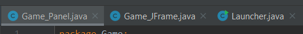
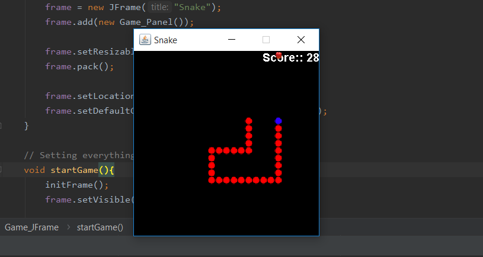
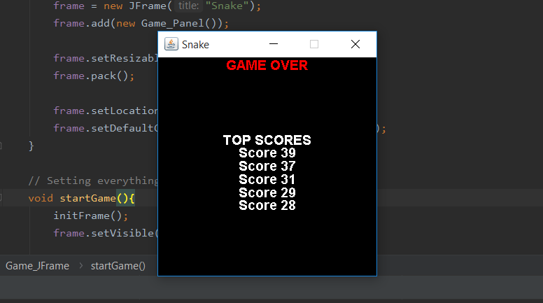
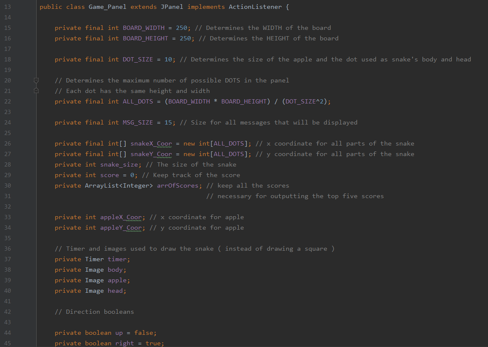
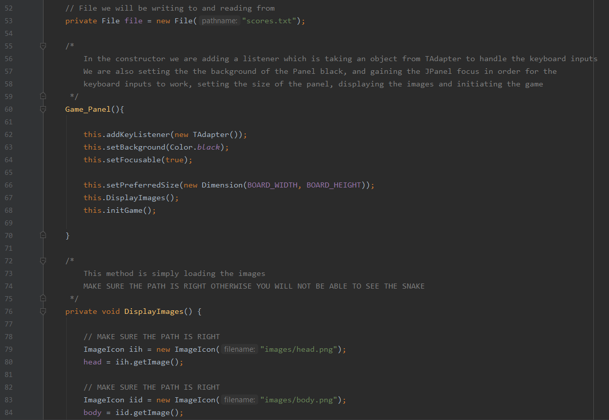
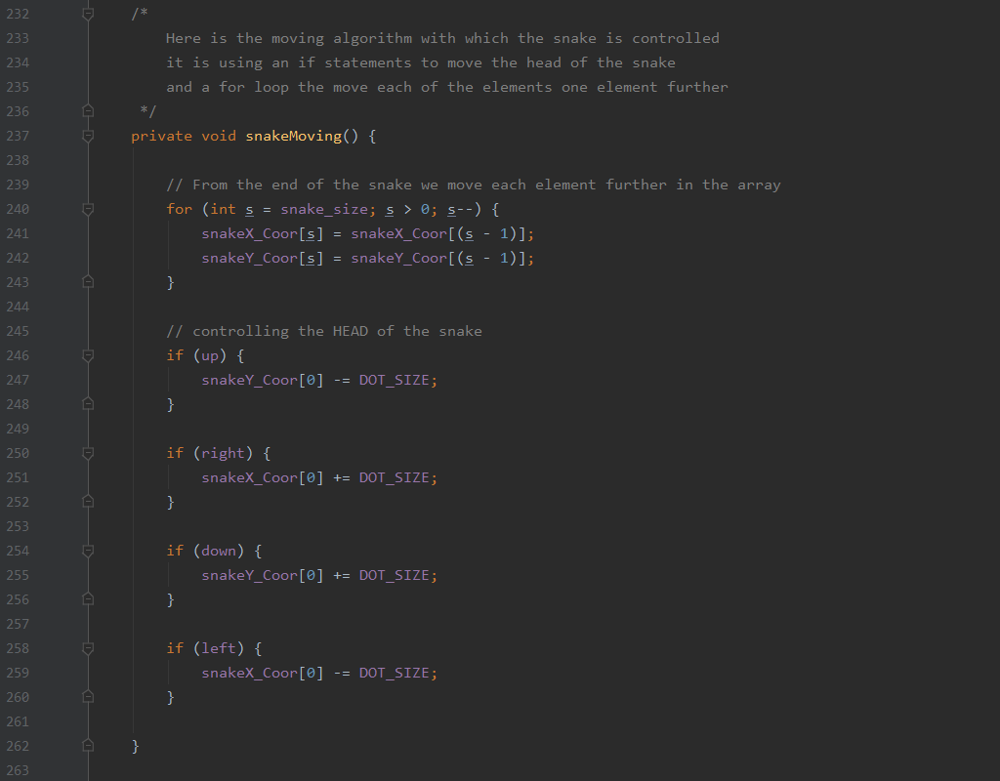
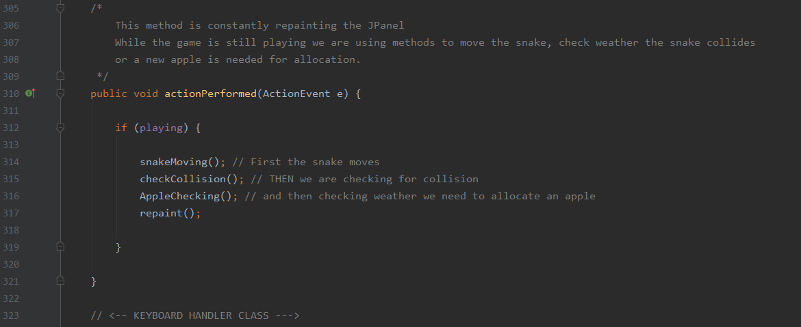

# Snake review
The program uses 3 classes Game_Panel, Game_JPanel, Launcher

It is obtaining the user input from the left, up, down and right arrow and keeps track of the current score
We are loading images for the body and the head of the snake, also for the apple.

Game keeps track of the top 5 scores.

# Some of the functionalities.
# Everything is explained within the comments of the program

Most of the program is written in the Game_JPanel class.
Member variables of Game_JPanel.

Constructor

Main logic e.g. How the snake is actually moving.

actionPerformed method.

